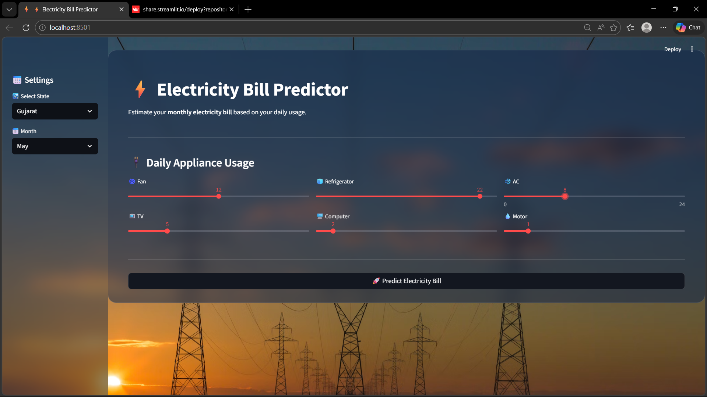
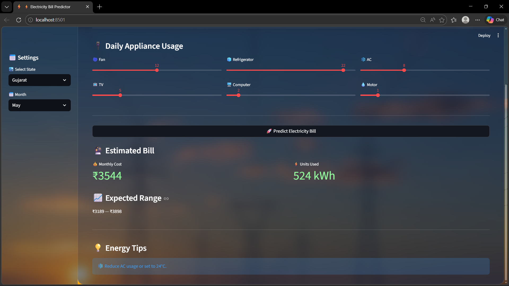

<h1 align="center">⚡ Electricity Bill Prediction using Physics-Informed Machine Learning</h1>

<div align="center">
  A production-ready web application that combines physics-based energy calculations, state-wise electricity slab pricing, and an ensemble machine learning model to accurately predict household electricity bills.
</div>

<p align="center">
  <br>
  
  
  
  
  
</p>

## 📋 Table of Contents
- [📖 Problem Statement](#-problem-statement)
- [📉 Dataset Overview](#-dataset-overview)
- [🤖 Model Performance Matrix](#-model-performance-matrix)
- [📸 Application Interface](#-application-interface)
- [⚙️ In-Depth Execution Guide (How to Run)](#️-in-depth-execution-guide-how-to-run)
- [🔮 Future Improvements](#-future-improvements)

---

## 📖 Problem Statement

Predicting household electricity bills using only machine learning often leads to unrealistic results. Standard ML models might predict an energy bill that violates the strict constraints of actual appliance physics or ignores the non-linear, tier-based slab pricing structures used by state utility companies. This causes standard tabular ML models to struggle when exposed to extreme values, leading to poor generalization in real-world engineering scenarios. 

This pipeline models the **ratio** between theoretical physics-based consumption and actual billed amounts, bounding the data strictly in mathematical reality before predicting the variation.

---

## 📉 Dataset Overview

The dataset consists of **2,703 precisely engineered records** covering 30 interactive features. It simulates realistic household energy behaviors constrained by actual appliance physics. The model successfully maps the variance between strict physical electricity calculations and the actual billed amounts.

### Target Distribution (`Actual Target / Physics Baseline`)

| Metric | Target Value |
| :--- | :--- |
| **Mean Ratio** | `1.275` |
| **Standard Deviation (Std)** | `0.060` |
| **Minimum Ratio** | `0.850` |
| **Maximum Ratio** | `1.300` |

---

## 🤖 Model Performance Matrix

Data modeling is executed sequentially through individual algorithm tuning using `RandomizedSearchCV`, culminating in an optimized stacking ensemble model.

* **Data Split:** Train: `1,892`, Validation: `405`, Test: `406`

### Algorithm Hyper-Tuning & Validation Set Matrices

| Model Architecture | Tuned Parameters | Validation R² | Validation RMSE | Validation MAE |
| :--- | :--- | :--- | :--- | :--- |
| **Ridge Regression** | `alpha`: 12.915 | `0.9556` | ₹109 | ₹72 | 
| **RandomForest** | `n_trees`: 200, `min_leaf`: 10, `max_depth`: 5 | `0.9566` | ₹107 | ₹66 |
| **XGBoost** | `lr`: 0.03, `depth`: 3, `trees`: 150, `subs`: 0.8... | `0.9551` | ₹109 | ₹69 |

### 🏆 Final Model: Stacking Ensemble
A multi-layered stacking model combining the outputs of the linear Ridge constraints and the Tree-based predictions. Evaluation verifies zero overfitting across evaluation boundaries.

| Metric | Validation Set (`405` rows) | Test Set (`406` rows) |
| :--- | :--- | :--- |
| **Ensemble R² Score** | **`0.9563`** | **`0.9515`** |
| **Ensemble RMSE** | **`₹108`** | **`₹111`** |
| **Ensemble MAE** | **`₹68`** | **`₹71`** |

*(Model securely serialized via Joblib to `models/electricity_model.pkl`)*

---

## 📸 Application Interface

| Home View (Settings & Inputs) | Prediction Output (Estimates & Tips) |
| :---: | :---: |
|  |  |

---

## ⚙️ In-Depth Execution Guide (How to Run)

The repository provides modular scripts to reproduce the ML pipeline from scratch and launch the interactive UI.

### 1. Environment Setup

* **Clone the repository:**
  ```bash
  git clone https://github.com/sahil-vasani/electricity-bill-prediction-ml.git
  cd electricity-bill-prediction-ml
  ```

* **Create & Activate a Virtual Environment (Highly Recommended):**
  ```bash
  # Windows
  python -m venv venv
  .\venv\Scripts\activate
  
  # macOS/Linux
  python3 -m venv venv
  source venv/bin/activate
  ```

* **Install Dependencies:**
  ```bash
  pip install -r requirements.txt
  ```

### 2. Running the ML Pipeline (Data Processing & Training)

To run the orchestrator processing pipeline log output exactly as framed above:

```bash
python main.py
```
**What happens under the hood:**
1. Loads raw dataset from `data/electricity_bill_dataset.csv`.
2. Formats appliance inputs and encodes regional features (`src/preprocess.py`).
3. Computes the `physics_bill` using individual state slab rates (`src/slab_rates.py` & `src/feature_engineering.py`).
4. Generates modeling exports to `data/processed.csv`.
5. Iteratively trains Ridge, RF, XGBoost, and Stacks the final model while logging cross-validation (`src/train_model.py`).
6. Saves `models/electricity_model.pkl`.

### 3. Launching the Web Application

To use the interactive dashboard for predictions, run the following command to start the Streamlit server:

```bash
streamlit run app.py
```
* **Local URL:** `http://localhost:8501`
* **Usage:** Select your state, current month, and slide the appliance hours. Click "Predict Electricity Bill" to see your estimated monthly cost, units consumed (kWh), and intelligent energy tips.

## 🔮 Future Improvements

* ☀️ **Solar Panel Integration:** Account for net-metering laws and solar generation offsets.
* 💰 **Subsidy Mechanisms:** Add dynamic logic for government electricity subsidies based on consumption limits.
* 🕰️ **Time-of-Use (ToU) Pricing:** Factor in smart-meter dynamic pricing structures (peak vs. off-peak hours).